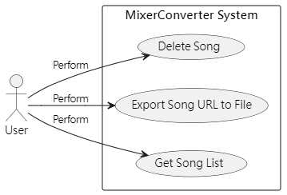
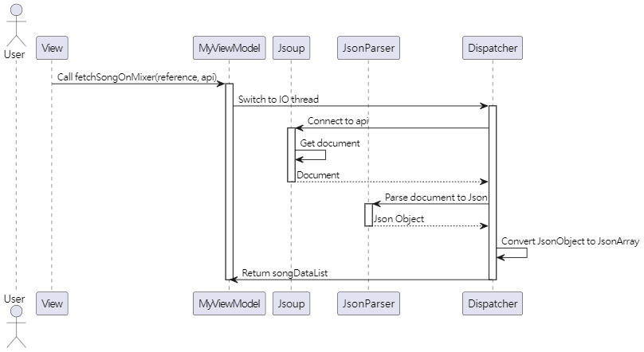
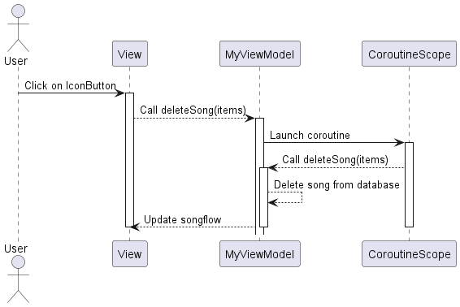
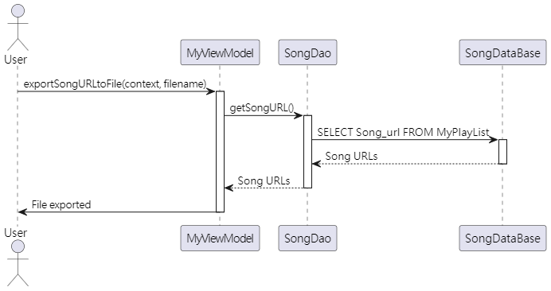
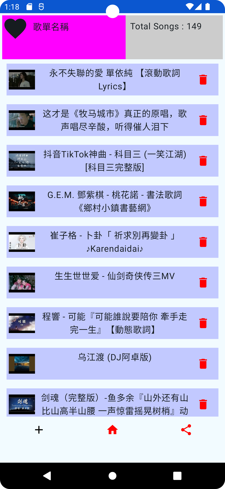
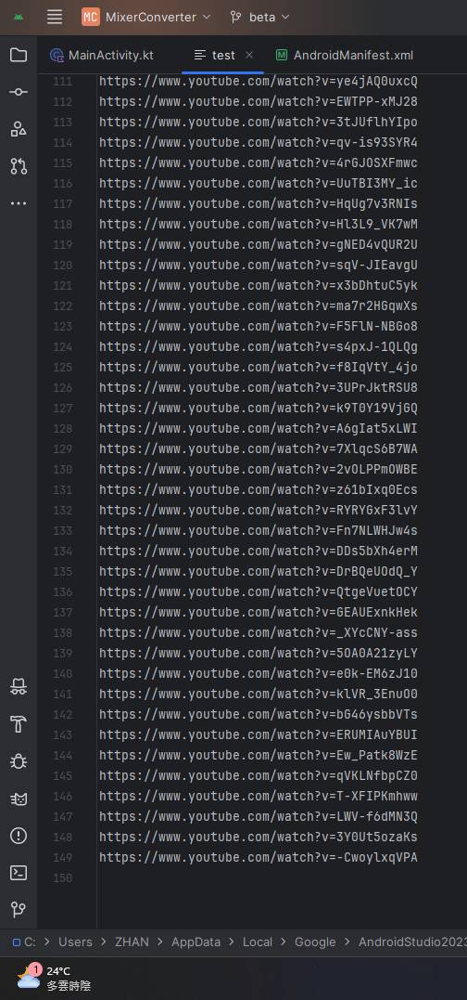
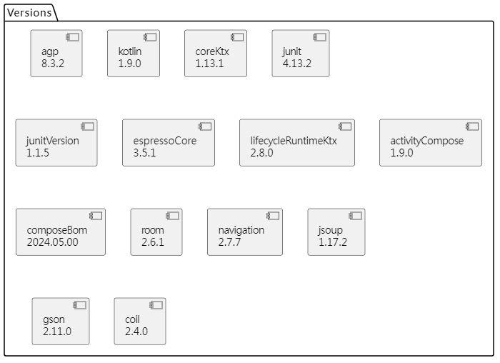
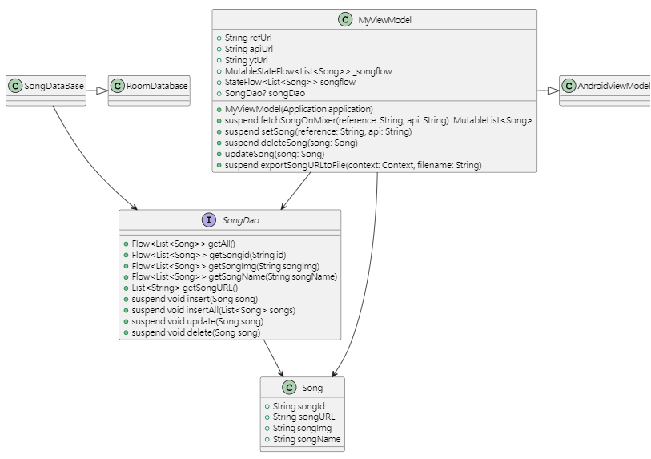
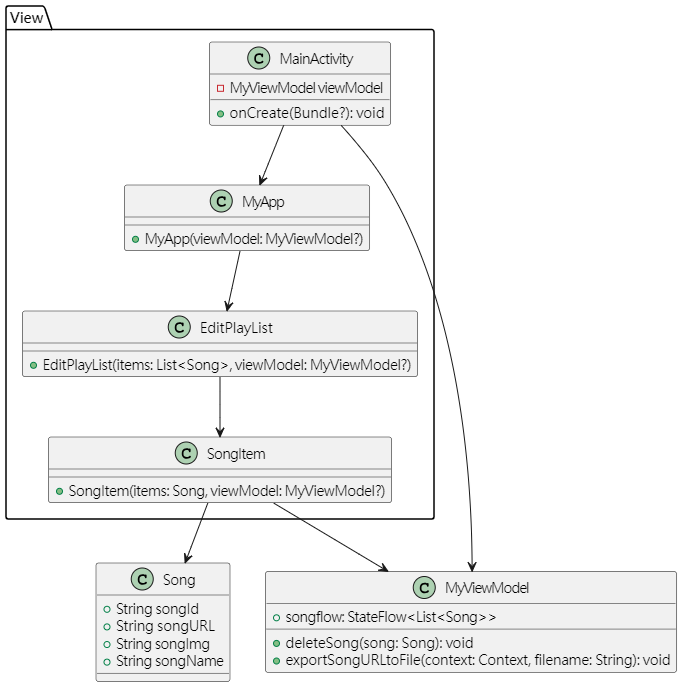

---

marp: true
theme: gaia
class: lead
paginate: true

---

<!-- _paginate: false -->

# 行動裝置程式設計-期末專題報告

Project_name : ***MixerConverter***

班級 : 資工四甲  
姓名 : 謝智翰  
學號 : 1108405052  

---

## 目錄

1. [研究動機](#研究動機)
2. [包含的服務](#包含的服務)
3. [設計架構](#設計架構)
4. [操作流程](#操作流程)
5. [收穫](#收穫)
6. [附錄](#附錄)

---

## 研究動機

Mixer 做為一個 Android 平台的免費音樂播放軟體，擁有許多用戶，不過在Youtube 版權政策更新之後，不再能簡單的轉換並下載歌曲了，且 Mixer 本身不支持批量下載歌曲，無法透過下載來離線播放，或是透過 下載到 USB 等方式，在不支援串流平台播放功能的車載音響上，播放自己的歌單，這隻程式是為了解決這類問題，並聚焦在轉換功能上

---

## 包含的服務

功能包含如下 :  

1. 利用 Mixer 的 "**分享歌單**" 連結來獲取歌單
2. 實時查看獲取的歌單，並可對其進行刪除等操作
3. 獲取轉換後的 YouTube URL 集合

---

## 設計架構

對應了上述三種功能  
詳細的類圖會附在最後



---

## Get Song List

由於目前是初始化，歌單生成暫不需要使用者互動  



---

## Delete Song

使用者按下 IconButton 時會刪除對應歌曲



---

## Export Song URL To File

按下分享按鈕會匯出整份歌單的TXT檔



---

## 操作流程

左邊是初始畫面
隨便挑幾首按下紅色垃圾桶(刪除)
效果如右邊那張圖
右上角為歌單裡總歌曲數量
範例裡砍了4首




---

## 操作流程

預設儲存路徑是
**/storage/emulated/0/Android/data/com.example.mixerconverter/files/file_name**
右邊是上面刪除完後匯出的
共有149行(149首歌的URL)



---

## 收穫

預計本來想熟悉的一些元件和功能
在這份demo中得到了充分的表演舞台  
其中 :  

* Flow負責了實時響應和資料的傳遞
* 無論是爬蟲的網路請求，或是資料庫的交互都屬於耗時操作，因此也使用了很多協程
* 整篇使用了Jetpack Compose，因此不需要在邏輯與XML之間來回跳躍
* 相比JDBC友善很多的room和DAO，是一開始看到就蠻想玩的API
* TOML 的集中管理讓區塊之間的工作邏輯更乾淨和清晰

---

## 收穫

最大的收穫和驚喜其實是
**room + Flow + LazyColumn**
既保證了使用時的載入不會過於臃腫
同時保證了UI的實時更新
實現的難度也蠻低的
觀念稍微亂一點而已
整理清楚之後覺得這套組合
確實非常強大

---

## 附錄

### lib.versions.toml

使用了toml檔來集中管理各種依賴和依賴庫的版本，其中  
Jsoup、gson、coil是外部庫
對應爬蟲、解析Json檔、顯示縮圖三項功能



---

## 附錄

### Class Diagram(Model)


---

## 附錄

### Class Diagram  (ViewModel)



---

## 附錄

### Class Diagram(View)



---

## 附錄

### 設定

```XML
<!-- AndroidManifest -->
<!-- 開啟網路權限 -->
    <uses-permission android:name="android.permission.INTERNET"/>
```

```kotlin
// build.gradle.kts(Module :app)
// 關於SDK的版本設定
    compileSdk = 34 // 設定編譯SDK版本
    minSdk = 26 // 最低支持的SDK版本
    targetSdk = 34 // 目標SDK版本
```

---

## 附錄

### 參考網站

1. [獲取JS動態內容](https://blog.51cto.com/itafei/2072331)

2. [協程-1](https://rengwuxian.com/kotlin-coroutines-1/)

3. [協程-2](https://rengwuxian.com/kotlin-coroutines-2/)

4. [協程-3](https://rengwuxian.com/kotlin-coroutines-3/)
