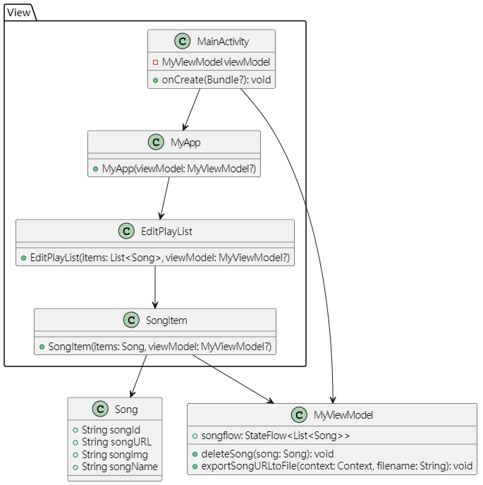
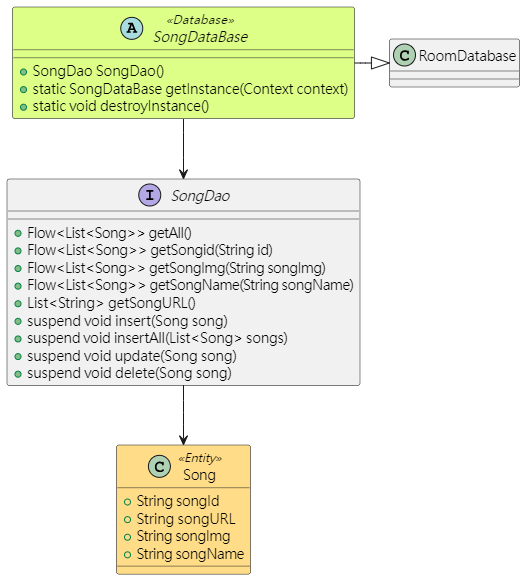
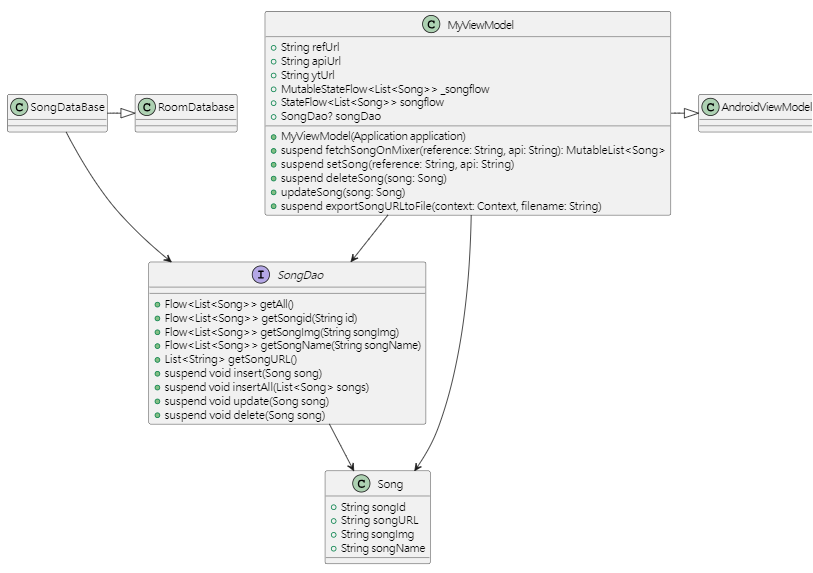

---

marp: true
theme: gaia
class: lead
paginate: true

---

# 行動裝置程式設計-期末專題報告

Project_name : ***MixerConverter***

班級 : 資工四甲  
姓名 : 謝智翰  
學號 : 1108405052  

---

## 目錄

1. 研究動機
2. 包含的服務及如何實現
3. 設計架構
4. 操作流程
5. 收穫

---

## 研究動機

Mixer 做為一個 Android 平台的免費音樂播放軟體，擁有許多用戶，不過在Youtube 政策更新之後，不再能簡單的轉換並下載歌曲了，且 Mixer 本身不支持批量下載歌曲，無法透過下載來離線播放，或是透過 下載到 USB 等方式，在不支援串流平台播放功能的車載音響上，播放自己的歌單，這隻程式是為了解決這類問題，並聚焦在轉換功能上

---

## 包含的服務

功能包含如下 :  

1. 利用 Mixer 的 "**分享歌單**" 連結來獲取歌單
2. 實時查看獲取的歌單，並可對其進行刪除等操作
3. 獲取轉換後的 YouTube URL 集合

---

## 設計架構

嘗試使用MVVM模式開發，即 Model - View - ViewModel
同時嘗試使用toml來集中管理依賴版本，以下將分開介紹

---

## MVVM 中的 View

由於嘗試使用了  
Jetpack Compose 寫法
因此在類別圖中只有  
function 和變數  
並沒有 Find.ById 等連結元件方式


---

## MVVM 中的 Model

定義了 DataBase
Song 是資料表
DAO 中定義了基礎的增刪查
查詢method回傳型態為 Flow
增和刪皆為 suspend function



---

## MVVM 中的 ViewModel

幾個方法後續附上程式碼介紹



---

## fetchSongOnMixer

Jsoup爬蟲，並透過gson解析成jsonObject

```kotlin
val songDataList = mutableListOf<Song>()
//以下程式碼運行在IO線程中

//爬蟲並轉換成JsonObject
val document = Jsoup.connect(api)
                    .ignoreContentType(true)
                    .referrer(reference)
                    .get()
val jsonStr = document.body().text()
val jsonObject = JsonParser.parseString(jsonStr)
                            .asJsonObject

//將JsonObject轉成JsonArray，方便待會遍歷
val itemListArray = jsonObject.getAsJsonArray("items")
```

---

## fetchSongOnMixer

最後回傳整個

```kotlin
//遍歷，透過run簡化，"f" 跟 "tt"都有的狀況下做處理，否則統一回傳不存在
for (element in itemListArray) {
    element.asJsonObject.run {
        if (has("f") && has("tt")) {
            //"f" 為歌曲的唯一ID
            val id = element.asJsonObject.get("f").asString

            //透過ID轉換成可訪問的縮圖
            val imgUrlStart = "https://i.ytimg.com/vi/"
            val imgUrlEnd = "/default.jpg"
            val img = imgUrlStart + id + imgUrlEnd

            //"tt" 為歌名
            val name = element.asJsonObject.get("tt").asString

            val url = ytUrl + id

            //回傳並add到List裡
            val songData: Song = Song(songId = id, songImg = img, songName = name, songURL = url)
            songDataList.add(songData)
        } else {
            println("歌曲不存在")
        }
    }
}
```

---

## setSong

負責把抓取到的資料賦值給 Flow 並新增進資料庫

```kotlin
    private suspend fun setSong(reference: String, api: String){
        withContext(Dispatchers.IO) {
            try {
                _songflow.value = fetchSongOnMixer(reference, api)
                songDao?.insertAll(_songflow.value)
            }
            catch (e : Exception){
                _songflow.value = emptyList()
                Log.d("set error", e.message.toString())
            }
        }
    }
```

---

## 操作流程

操作流程內容...

---

## 收穫

收穫內容...
